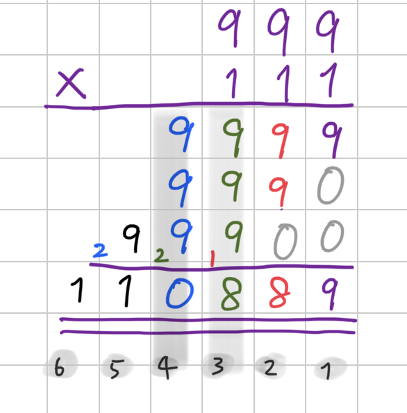
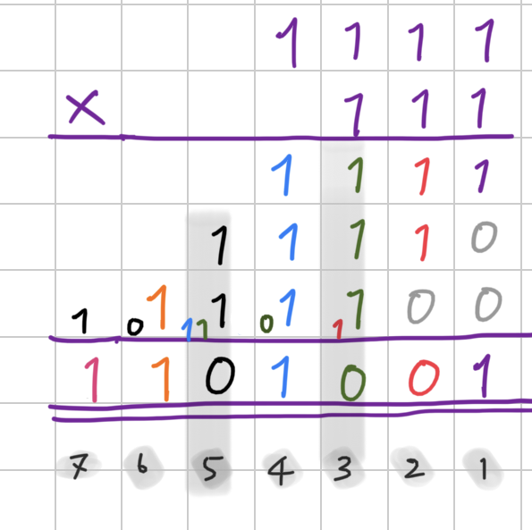

Imagine if we had only two fingers instead of ten. Would we still use Decimal counting, base-10, zero to nine? Or we would naturally use two digits: zero and one to count: binary numeral system. The following shows some examples of binary numbers (indicated with subscript \_2) and their Decimal counterparts.


\begin{aligned}
0_2 &= 0 \\\\
1_2 &= 1 \\\\
10_2 &= 2 = 1+1\\\\
11_2 &= 3 = 1+1+1\\\\
100_2 &= 4 = 1+1+1+1 \\\\
101_2 &= 5 = 1+1+1+1+1\\\\
\end{aligned}


At first sight, the binary system might look confusing. However, the arithmetic operations on the binary number are essentially the same as we have on a Decimal one: we still have carry-over in summation and borrowing in subtraction.

The same applies to multiplication. First, let's try to do simple multiplication on decimal numbers:


999 \times 111


Here, we can see that in column 3, we have 9+9+9+1=28
and carry over the "extra digit" 2 to the next decimal place.

Let's try the same on binary numbers:


1111_2 \times 111_2


Again, in column 3, we have 1+1+1+1=100_2. What we didn't see in the example of Decimal numbers above is: Here, we need to carry over the additional digits in 100_2 to the next and the following binary places: 1 to column 5 and 0 to column 4.
