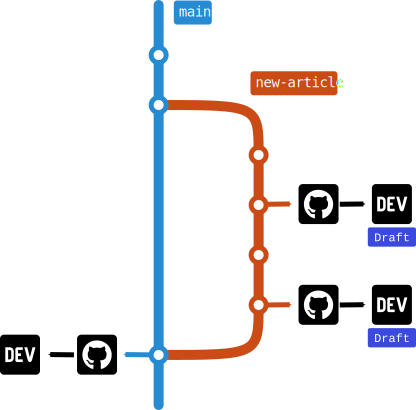

How do you write your article for [DEV](https://dev.to/)? Do you use the markdown editor provided by DEV on the browser? Or do you use your favorite editor on your local machine? If you do use a regular editor on your PC, how do you submit the article to DEV?

I like to use [my favorite editor](https://neovim.io/) to write articles. When I am ready to publish an article, I have to copy and paste the texts into the online editor, then click the "Publish" button. Sometimes I want to see how DEV is showing the article while I am in the middle of the writing. Therefore, my writing experience usually involves more than one copy-pasting. As you can imagine, this is troublesome, tedious, and not a good experience at all.

I also like to use [Git](https://git-scm.com/) to manage the versions of my articles. Then I can also push the articles into [GitHub](https://github.com). Since GitHub renders Markdown files, readers also can read the articles on GitHub if they choose to. Of course, images should work as expected on GitHub if we use relative links and commit the image files too. Now I also have a backup system for my articles.

# Workflow with GitHub Actions



I want everything described above to be fully automated. The diagram above shows the workflow I want to realize with GitHub Actions. When I want to start writing a new article, I will branch out from the main branch and start writing. When I want to see how this article looks on DEV, I can push the new branch to GitHub and make a (draft) pull request. At this instance, my GitHub Action should submit the article to DEV as a draft. I can merge the branch back into the main branch when I am ready to publish the article.

# `devto`: the CLI Tool

The first thing that I need to make all these happen is a CLI tool that helps me submit articles to DEV from the terminal. For this, I've created a CLI tool called `devto` with Go.



The tool makes use of the [APIs that DEV kindly provides in OpenAPI specification](https://docs.dev.to/api/). `devto` mainly does two things:

- It collects all image links from the Markdown file into a `devto.yml` file with the `generate` subcommand. For example, if we have `./image-1.png` and `./image-2.png` in the Markdown file, we will get the following:
  ```yml
  images:
    ./image-1.png: ""
    ./image-2.png: ""
  ```
- It submits the article to DEV with the `submit` subcommand. The `submit` subcommand creates a new article in DEV and updates the `devto.yml` with the resulting `article_id`. `devto` will use this `article_id` in the following execution to perform an update operation instead of creating a new entry for the same article.

The DEV API does not have a way of uploading images yet. If we submit a Markdown content with relative paths of image links, DEV will not be able to show those images. As a workaround of this problem, we need to provide a full path for the images either manually via the `devto.yml` file or using the `--prefix` flag. We will elaborate more on this in the GitHub Actions section.

# `devto-act`: the GitHub Action



This GitHub Action mainly uses the `devto` CLI tool with one "special" feature: the auto prefix functionality. If you have the following GitHub repository `user/repo` and you are pushing a new branch `new-article` for a new article, `devto-act` will use `https://raw.githubusercontent.com/user/repo/new-article/` as the value of the `--prefix` flag for the `submit` subcommand. As a result, image links in the Markdown content, e.g.:

```md


```

will become

```md


```

on DEV. That means we are hosting the images on GitHub instead of DEV.
