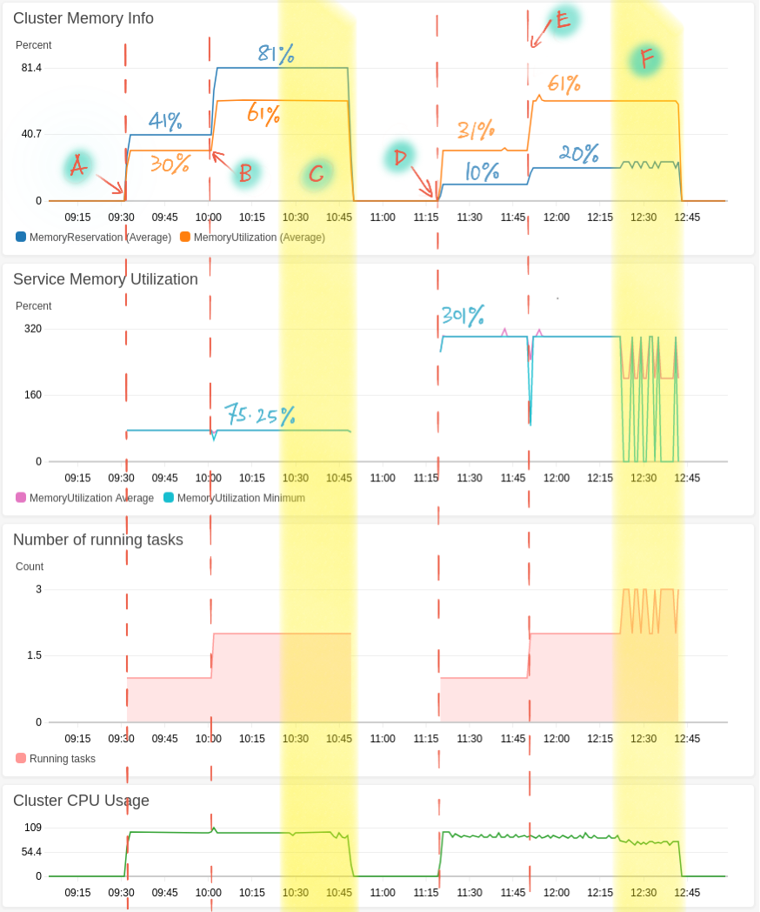
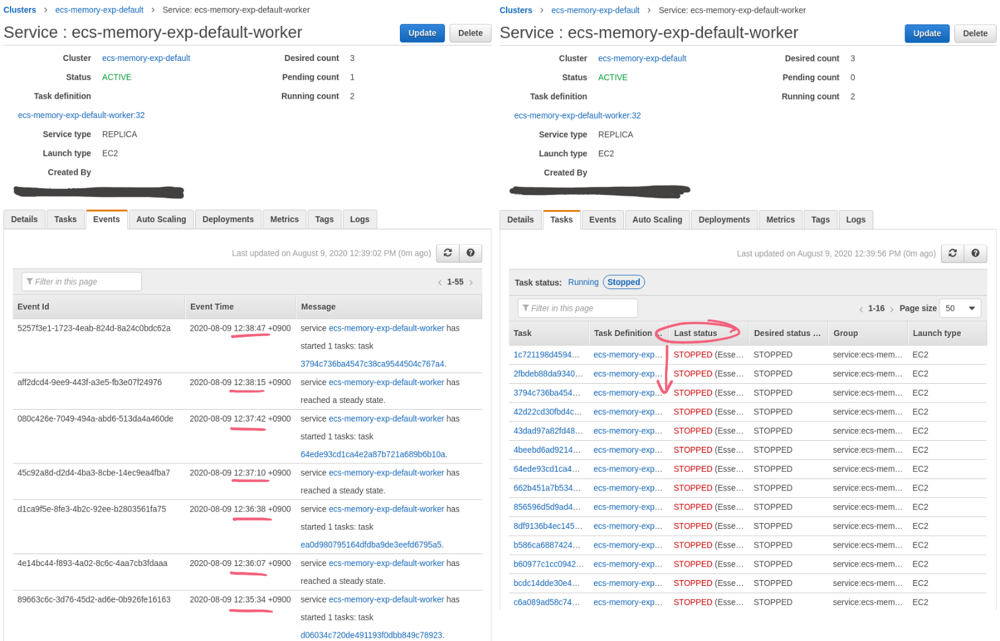

Amazon Elastic Container Service (ECS) provides the means to developers to orchestrate Docker containers running in Amazon Web Services (AWS). Using ECS develops will be able to deploy and command a fleet of Docker containers, scale the services, etc. in a very flexible manner within the ECS cluster.

We use [**task definition**](https://docs.aws.amazon.com/AmazonECS/latest/developerguide/task_definitions.html) to describe how we want a Docker container to be deployed in an ECS cluster. `memoryReservation` is one of the **container definitions** that need to be specified when writing the task definition, see [Task definition parameters by AWS](https://docs.aws.amazon.com/AmazonECS/latest/developerguide/task_definition_parameters.html#container_definitions):

> If a task-level memory value is not specified, you must specify a non-zero integer for one or both of memory or memoryReservation in a container definition.

Specifying X amount of `memoryReservation` tells ECS that this particular Docker container might need X amount of memory in MiB. It is a soft limit, which means that the container is allowed to use more than we reserved. Also [from the same reference](https://docs.aws.amazon.com/AmazonECS/latest/developerguide/task_definition_parameters.html#container_definitions):

> When system memory is under contention, Docker attempts to keep the container memory to this soft limit; however, your container can consume more memory when needed, up to either the hard limit specified with the memory parameter (if applicable), or all of the available memory on the container instance, whichever comes first.

> The Docker daemon reserves a minimum of 4 MiB of memory for a container, so you should not specify fewer than 4 MiB of memory for your containers.

Reading the above, some might get the idea that why not be flexible and just set `memoryReservation` for all containers to 4 MiB then let ECS figures out how many memory that the container needs. In this article, we want to help the readers to understand why this is not a good idea. Then also try to help the readers to choose a reasonable value for `memoryReservation`.

# Experimental Setup

For demonstration purposes, we are going to setup a very simple playground in ECS. It is an EC2 launch type ECS cluster with a single ECS instance of type [**t2.micro** that has 1 GiB of memory](https://aws.amazon.com/ec2/instance-types/). In the cluster, we will create an ECS service that consists of following task definition:

```json
[
  {
    "name": "worker",
    "image": "alexeiled/stress-ng:latest",
    "command": [
      "--vm-bytes",
      "300m",
      "--vm-keep",
      "--vm",
      "1",
      "-t",
      "1d",
      "-l",
      "0"
    ],
    "memoryReservation": 400
  }
]
```

Essentially, this task definition will launch a container that is constantly consuming `300 MB / 1.049 = 286.102 MiB` of memory (see [`stress-ng`](https://manpages.ubuntu.com/manpages/artful/man1/stress-ng.1.html)). We can think of this as a memory hungry worker. The Terraform configuration of the set up is available in GitHub:



# The Experiments

The following shows the metrics that we collected during our tests. We tested two different ECS configurations. The first half shows what happened when the memory is properly reserved. The second half was where a very small value was used as `memoryReservation`. We will walkthrough the whole process from `(A)` to `(F)` in the following text.



## First part: The right way

Since we know that our container will consume around 286 MiB of memory, the `memoryReservation` is set to 400 MiB to begin the test.
Let's start the test by placing one task into the ECS cluster. We accomplish that by setting the **desired count** to `1`.
From our CloudWatch metrics (see `(A)`), we can see that after placing one task into the cluster, we essentially reserving 41% and using 30% of the memory from the cluster in average. Service memory utilization is at 75.25% means that we are using 75.25% or the memory that we reserved for the service. The formulas for how these values are derived is available in the [Amazon ECS CloudWatch metrics](https://docs.aws.amazon.com/AmazonECS/latest/developerguide/cloudwatch-metrics.html#cluster_reservation) documentation.

The metrics also show that increasing the number of desired count from 1 to 2 (see `(B)`) worked as expected: Both memory reservation and utilization average percentage doubled. Service memory utilization stays at 75.25% because we are still using 75.25% or the memory that we reserved for the service even though the usage of the memory in MiB is doubled.

Finally we want to try to "break" the system by increasing the desired task to 3 in `(C)`. Adding the third task means that we need to reserve `3 x 400 MiB = 1200 MiB` for our workers.

Since this is more than what the cluster could support, ECS will tell us the following:

> service ecs-memory-exp-default-worker was unable to place a task because no container instance met all of its requirements. The closest matching container-instance xxxxxxxxxxxxxxxxxxxxxxxxxxxxxxxx has insufficient memory available. For more information, see the Troubleshooting section.

instead of forcefully placing the third task. Note that we observed no fluctuation in our CloudWatch metrics in `(C)`.
This is a good fail-safe. Failing to place the third task does not cause any disruption to the running tasks. What we need to do now is to add more resources into the cluster for the additional tasks that we want to run.

## Second part: What could go wrong?

Now, let's repeat the same experiment with one different setting: only 100 MiB of `memoryReservation`. Here, we set the desired count to 1 at `(D)` and then to 2 at `(E)`.
We can observe in the metrics that cluster memory utilization is always higher than what we've reserved. Service memory utilization is around 301% that means we are using three times more than what we promised to use.

Let's try to put the third task into the cluster by setting the desired task to 3. Since ECS thought that the task only need 100 MiB, it will try to run the third task. However, this will cause one of the three tasks to stop due to insufficient memory, then ECS will again rerun the task to fulfill the desired count condition. As we can see from the events log and task statuses, and the fluctuation in the metrics `(F)`, there is an endless loop of running and stopping of ECS task. The fluctuation is a sign of an unstable system.

Note that although it may seem that we still have enough memory (there was still 39% leftover) for another task, we also need to consider the memory that is required by the host system (see [Container Instance Memory Management](https://docs.aws.amazon.com/AmazonECS/latest/developerguide/memory-management.html#ecs-reserved-memory)).



We also need to consider the problem where we have no direct control of which task/container to kill when there is memory insufficient issue (see [How Amazon ECS manages CPU and memory resources](https://aws.amazon.com/blogs/containers/how-amazon-ecs-manages-cpu-and-memory-resources/) by AWS):

> If containers try to consume memory between these two values (or between the soft limit and the host capacity if a hard limit is not set), they may compete with each other. In this case, what happens depends on the heuristics used by the Linux kernel’s OOM (Out of Memory) killer.

What if the Linux kernel's OOM killer decides to terminate a worker that is currently processing huge data rather than the newly spun-up worker? In a radical case, this means that it is possible that we could not process anything even though it may seem that we still have two workers running, they might be killed before completed their works.

# Wrap-up

Yes, ECS allows us to set a very small value for `memoryReservation`, but that does not mean it is a good idea to do it. We might find a “clever” workaround in such a small and simple system as one demonstrated above. However, production systems are usually more complex with multiple task definitions and container instances. Therefore, it is more difficult to spot the memory issue and to find the root cause of the endless restart in the real world. We can avoid all of these issues by using proper values set as `memoryReservation`. [Docker also recommends](https://docs.docker.com/config/containers/resource_constraints/#understand-the-risks-of-running-out-of-memory) that we correctly limit the memory usage of a container to mitigate the risk of system instability caused by Out Of Memory Exception (OOME).

So if not a minimal value, how should we set the `memoryReservation`? [AWS recommends that](https://docs.aws.amazon.com/AmazonECS/latest/developerguide/task_definition_parameters.html#container_definitions):

> ... if your container normally uses 128 MiB of memory, but occasionally bursts to 256 MiB of memory for short periods of time, you can set a memoryReservation of 128 MiB, and a memory hard limit of 300 MiB. This configuration would allow the container to only reserve 128 MiB of memory from the remaining resources on the container instance, but also allow the container to consume more memory resources when needed.

In the real world, it is not always that straight forward to know how much memory our application needs in contrast to the example we have above. Service memory utilization can be a metric to help us figure out how much memory our container normally uses. When its average is close to or exceeds 100%, it shows that our application is using more than what we expected, and we should increase the reservation or the resource accordingly.

Thanks for reading. I hope that you find this article useful ❤️.
