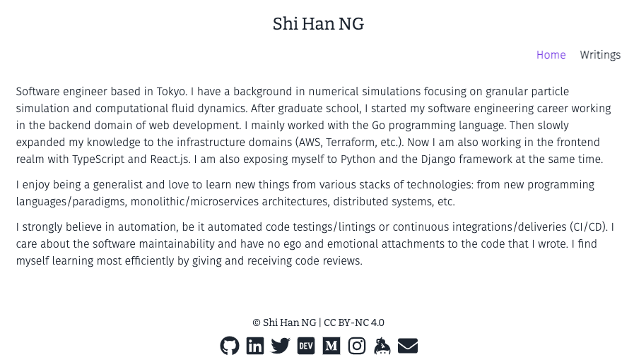
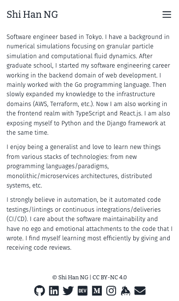
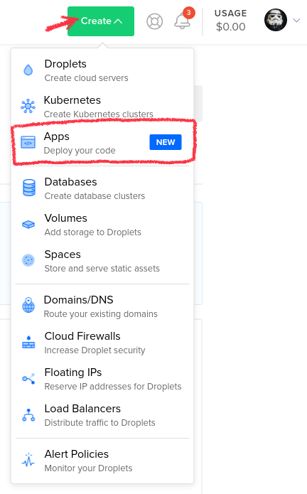
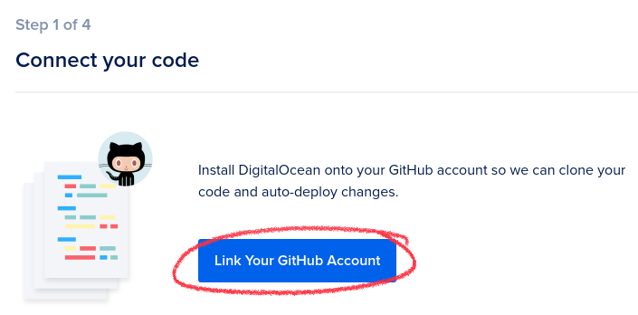
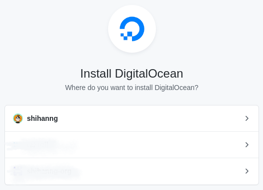
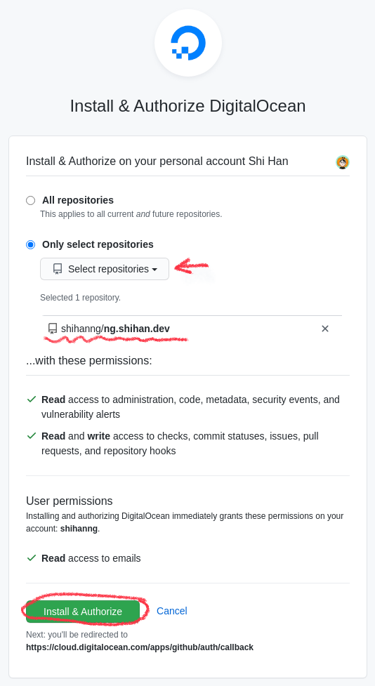
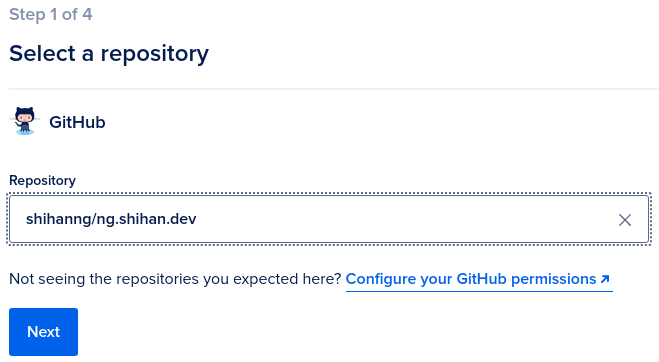
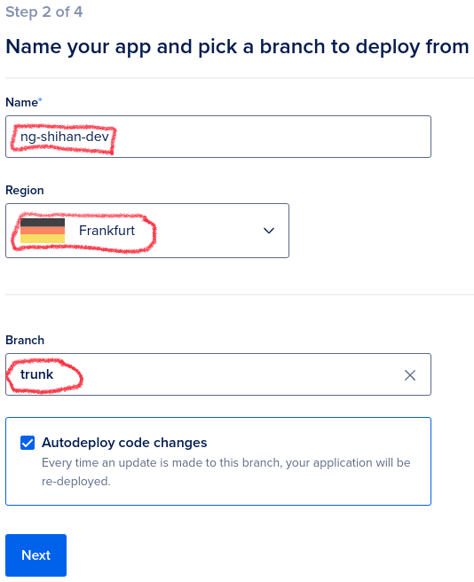
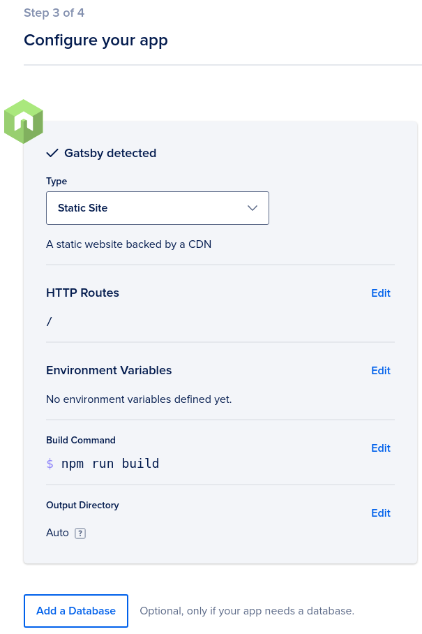
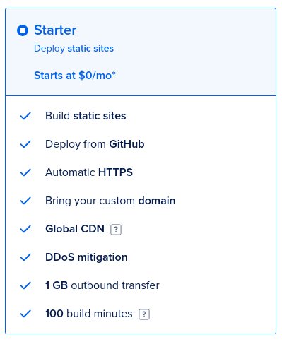

## What I built

A simple portfolio website.

### Category Submission:

Personal Site/Portfolio

### App Link

<https://ng.shihan.dev/>

### Screenshots

### Description

It is a simple and clean portfolio with [Gatsby](https://www.gatsbyjs.com/), [TypeScript](https://www.typescriptlang.org/), [React](https://reactjs.org/), and [tailwindcss](https://tailwindcss.com/). I come from a backend/infrastructure background, so frontend development is a challenge for me. I created this site without using any existing theme also made it responsive and looks good on mobile. It's not a super fanny site, but it's mine.

### Link to Source Code

<https://github.com/shihanng/ng.shihan.dev/>

### Permissive License

[MIT](https://github.com/shihanng/ng.shihan.dev/blob/trunk/LICENSE)

## Background

I had a bit of free time at the end of 2020, so I've decided to rebuild my portfolio website from [Hugo](https://gohugo.io/) to Gatsby. My motivation for rebuilding is to get more practice in TypeScript / React, the skills I picked up in 2020. I also want to try out tailwindcss too. Coincidently, I found out about [DigitalOcean App Platform Hackathon on DEV](https://dev.to/devteam/announcing-the-digitalocean-app-platform-hackathon-on-dev-2i1k). So, I decided to host the new site on the platform instead of GitHub Pages.

### How I built it (A detailed guide of deploying a Gatsby site to DigitalOcean’s App Platform)

I bootstrapped the site with `gatsby new` command. We don't need to tell Gatsby that we are using DigitalOcean's App Platform.

To create a new App, select **App** from the Create menu in the DigitalOcean console.

To deploy to DigitalOcean's App Platform from GitHub, we need to connect to our repository from the [App console](https://cloud.digitalocean.com/apps/).

This means that we need to install DigitalOcean on GitHub. It can also be installed in an organization account.

We can also limit the repository that DigitalOcean has access to. E.g. for my case, I am only allowing it to access the repository that contains the source code of my site.

Once we have the permission setup on GitHub, we can then select a repository from DigitalOcean's App Platform.

Then, name our app, select a region, and pick the deployment branch. DigitalOcean will pick up any changes that I push to the trunk branch and deploy it.

We can see that DigitalOcean will be able to detect that the repository is a Gatsby project automatically. I did not need to change any settings here for my usecase.

Finally, we need to select a pricing plan. We can use the **Starter** plan for static sites like this one. We can build and deploy up to three Starter apps for free.

After this, we can relax and grab a cup of coffee while waiting for DigitalOcean to build and deploy the site.
