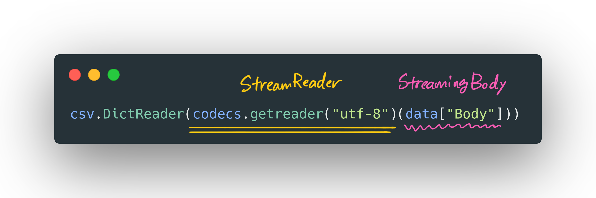

Here is a scenario. There is a huge CSV file on Amazon S3. We need to write a Python function that downloads, reads, and prints the value in a specific column on the standard output (stdout).

Simple Googling will lead us to the answer to this assignment in Stack Overflow. The code should look like something like the following:

```python
import codecs
import csv

import boto3


client = boto3.client("s3")

def read_csv_from_s3(bucket_name, key, column):
    data = client.get_object(Bucket=bucket_name, Key=key)

    for row in csv.DictReader(codecs.getreader("utf-8")(data["Body"])):
        print(row[column])
```

We will explore the solution above in detail in this article. Imagine this like a rubber duck programming and you are the rubber duck in this case.

## Downloading File from S3

Let's get started. First, we need to figure out how to download a file from S3 in Python. The official AWS SDK for Python is known as Boto3. [According to the documentation](https://boto3.amazonaws.com/v1/documentation/api/latest/reference/services/s3.html#client), we can create the `client` instance for S3 by calling `boto3.client("s3")`. Then we call the [`get_object()`](https://boto3.amazonaws.com/v1/documentation/api/latest/reference/services/s3.html#S3.Client.get_object) method on the `client` with bucket name and key as input arguments to download a specific file.

Now the thing that we are interested in is the return value of the [`get_object()`](https://boto3.amazonaws.com/v1/documentation/api/latest/reference/services/s3.html#S3.Client.get_object) method call. The return value is a Python dictionary. In the `Body` key of the dictionary, we can find the content of the file downloaded from S3. The body `data["Body"]` is a [`botocore.response.StreamingBody`](https://botocore.amazonaws.com/v1/documentation/api/latest/reference/response.html#botocore-response). Hold that thought.

## Reading CSV File

Let's switch our focus to handling CSV files. We want to access the value of a specific column one by one. [`csv.DictReader`](https://docs.python.org/3/library/csv.html#csv.DictReader) from the standard library seems to be an excellent candidate for this job. It returns an [iterator](https://docs.python.org/3/library/stdtypes.html#iterator-types) (the class implements the iterator methods `__iter__()` and `__next__()`) that we can use to access each row in a for-loop: `row[column]`. But what should we pass into X as an argument? According to the documentation, we should refer to the reader instance.

> All other optional or keyword arguments are passed to the underlying reader instance.

There we can see that the first argument `csvfile`

> can be any object which supports the iterator protocol and returns a string each time its **next**() method is called

`botocore.response.StreamingBody` supports the [iterator protocol](https://docs.python.org/3/glossary.html#term-iterator) :tada:.



Unfortunately, it's `__next__()` method does not return a string but bytes instead.

```console
_csv.Error: iterator should return strings, not bytes (did you open the file in text mode?)
```

## Reading CSV file from S3

So how do we bridge the gap between `botocore.response.StreamingBody` type and the type required by the `cvs` module? We want to "convert" the bytes to string in this case. Therefore, the [codecs module of Python's standard library](https://docs.python.org/3/library/codecs.html#module-codecs) seems to be a place to start.

> Most standard codecs are text encodings, which encode text to bytes

Since we are doing the opposite, we are looking for a "decoder," specifically a decoder that can handle stream data: [`codecs.StreamReader`](https://docs.python.org/3/library/codecs.html#streamreader-objects)

> Decodes data from the stream and returns the resulting object.

The `codecs.StreamReader` takes a [file-like object](https://docs.python.org/3/glossary.html#term-file-object) as an input argument. In Python, this means the object should have a `read()` method. The `botocore.response.StreamingBody` does have the `read()` method: <https://botocore.amazonaws.com/v1/documentation/api/latest/reference/response.html#botocore.response.StreamingBody.read>

Since the `codecs.StreamReader` also supports the iterator protocol, we can pass the object of this instance into the `csv.DictReader`: <https://github.com/python/cpython/blob/1370d9dd9fbd71e9d3c250c8e6644e0ee6534fca/Lib/codecs.py#L642-L651>

The final piece of the puzzle is: How do we create the `codecs.StreamReader`? That's where the [`codecs.getreader()`](https://docs.python.org/3/library/codecs.html#codecs.getreader) function comes in play. We pass the codec of our choice (in this case, `utf-8`) into the `codecs.getreader()`, which creates the`codecs.StreamReader`. This allows us to read the CSV file row-by-row into dictionary by passing the `codec.StreamReader` into `csv.DictReader`:



---

Thank you for following this long and detailed (maybe too exhausting) explanation of such a short program. I hope you find it useful. Thank your listening :heart:.
